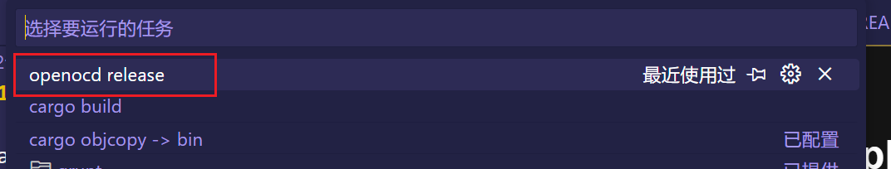

## template for stm32f103c8t6

by using VSCode, you can simply debug with one click

and then

and download with one click

### before usage

a few binary files and plugins are needed

- rustc
- cargo
- arm-none-eabi-*
- openocd

and

